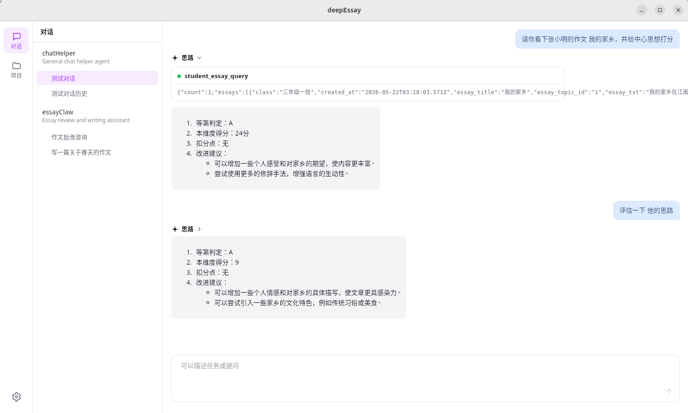
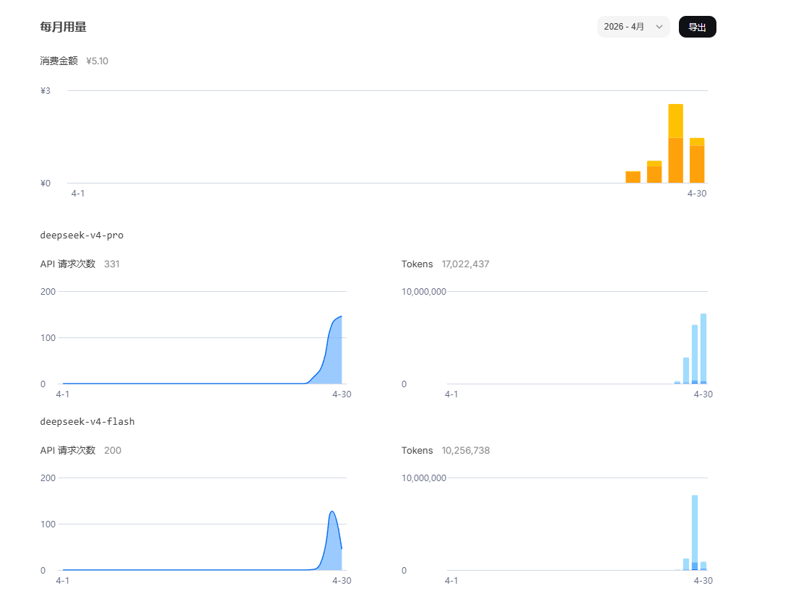
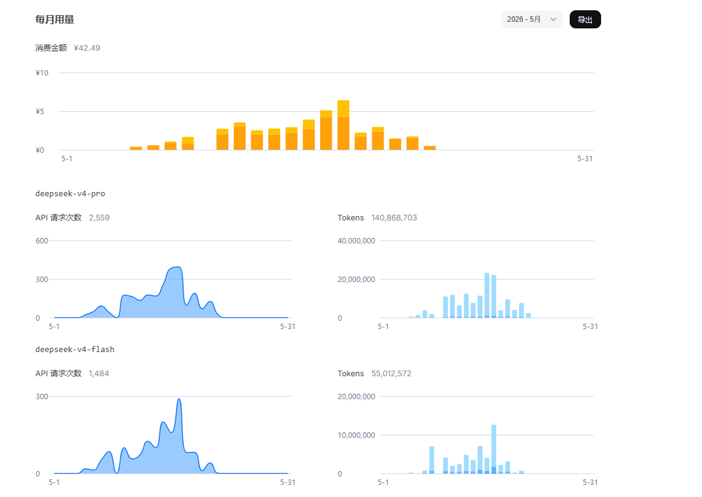

# deepEssayOuter

deepEssay 项目的外层仓库，存放架构文档、功能展示截图与 Token 消耗统计。

## deepEssay 是什么

**deepEssay** 是一款基于 Tauri 2 的桌面应用，定位为 **AI 作文批改助手**，专为中文写作教学场景设计。支持上传作文题目和学生作文数据，通过 LLM 进行智能批改、对比分析，并提供写作建议。

### 技术栈

| 层级 | 技术 |
|------|------|
| 桌面框架 | Tauri 2 |
| 后端语言 | Rust (edition 2024) |
| 前端框架 | Vue 3 (Composition API) + TypeScript |
| 构建工具 | Vite 8 |
| LLM 集成 | rig-core 0.30 (OpenAI-compatible) |
| 数据库 | libSQL (嵌入式 SQLite-compatible) |
| Markdown 渲染 | marked + DOMPurify |

### 核心特性

- **智能批改** — LLM 驱动的作文评阅，包含思考过程 (`<think>`) 与改进建议 (`<suggestions>`)
- **多轮对话** — 完整的 Session → Thread → Turn 会话管理体系
- **工具系统** — 内置作文题目查询、学生作文查询工具，LLM 可主动调用
- **技能系统** — 通过 SKILL.md 文件扩展 Agent 能力，支持关键词匹配激活
- **钩子系统** — 6 个生命周期钩子点 (BeforeInbound / BeforeToolCall / BeforeOutbound 等)
- **消息持久化** — 基于 libSQL 的完整对话历史存储
- **多通道支持** — Tauri IPC (前端 SSE) + CLI REPL 双通道架构

### 源码统计

Rust 后端 `backend/src/` 下的源码统计：

- 文件数：82 个 `.rs` 文件
- 代码行数：10,814 行

## 功能展示



## 本仓库结构

```
deepEssayOuter/
├── docs/                       # 架构文档
│   ├── architecture.md         # 完整架构文档
│   └── architecture_simplified.md  # 架构简图
├── function/                   # 功能展示截图
│   └── 功能展示.png
└── token_consumption/          # Token 消耗统计
    ├── 4月token消耗.png
    └── 5月token消耗.png
```

## 架构概览

```
┌──────────────────────────────────────────────────────────────────────┐
│                            Channels                                 │
│  ┌──────────┐              ┌─────────────────┐                      │
│  │   REPL   │              │  Web Gateway    │                      │
│  │(Terminal)│              │ (Tauri IPC+SSE) │                      │
│  └────┬─────┘              └────────┬────────┘                      │
│       └────────────┬───────────────┘                                │
│                    │                                                │
│          ┌─────────▼─────────┐                                      │
│          │    Agent Loop     │  SubmissionParser                    │
│          │  (handle_message) │  Intent routing                     │
│          └────────┬──────────┘                                      │
│                   │                                                 │
│          ┌────────▼────────┐                                       │
│          │Session Manager  │                                       │
│          │ Sessions/Threads│                                       │
│          └────────┬────────┘                                       │
│                   │                                                 │
│          ┌────────▼──────────────────────────┐                     │
│          │         Agentic Loop              │                     │
│          │  ┌─────────────────────────────┐  │                     │
│          │  │ Reasoning ─── LLM Provider  │  │  ← Skills 注入      │
│          │  │   (respond_with_tools)      │  │    上下文           │
│          │  └─────────────┬───────────────┘  │                     │
│          │                │                  │                     │
│          │  ┌─────────────▼───────────────┐  │                     │
│          │  │     Tool Execution          │  │  ← Hooks 拦截       │
│          │  │  run_one_tool / JoinSet     │  │    (BeforeToolCall) │
│          │  └─────────────────────────────┘  │                     │
│          └────────┬──────────────────────────┘                     │
│                   │                                                 │
│  ┌────────────────┼──────────────────┐                             │
│  │                │                  │                             │
│  │     ┌──────────▼────┐  ┌─────────▼─────────┐                    │
│  │     │Skills Registry│  │  Hooks Registry   │                    │
│  │     │  (SKILL.md)   │  │(6 lifecycle pts)  │                    │
│  │     └───────────────┘  └───────────────────┘                    │
│  └─────────────────────────────────────────────────────────────────┘│
│                   │                                                 │
│          ┌────────▼────────┐                                       │
│          │  Tool Registry  │                                       │
│          │  (Built-in:     │                                       │
│          │  Essay Topic    │                                       │
│          │  + Student)     │                                       │
│          └────────┬────────┘                                       │
│                   │                                                 │
│          ┌────────▼────────┐                                       │
│          │    Database     │                                       │
│          │    (libSQL)     │                                       │
│          └─────────────────┘                                       │
└──────────────────────────────────────────────────────────────────────┘
```

详细架构请参阅 [docs/architecture_simplified.md](docs/architecture_simplified.md) 与 [docs/architecture.md](docs/architecture.md)。

## 开发状态

核心链路已贯通：前端聊天界面 → Tauri IPC 通道 → Agent 消息分发 → Session 管理 → Agentic Loop 多轮推理 → LLM 调用 → 工具执行 → 响应渲染 (Markdown)。配套的持久化 (libSQL)、技能系统 (SKILL.md)、钩子系统 (6 个生命周期节点) 也已完成。

待完成功能包括：审批流程 (Approval)、上下文压缩、多 LLM Provider 支持、前端剩余页面完善、ToolCall 可视化等。

完整清单详见 [architecture.md 第14节](docs/architecture.md#14-当前开发状态-2026-05-22)。

## Token 消耗

总 Token 消耗 2 亿+

### 2026年4月



### 2026年5月



